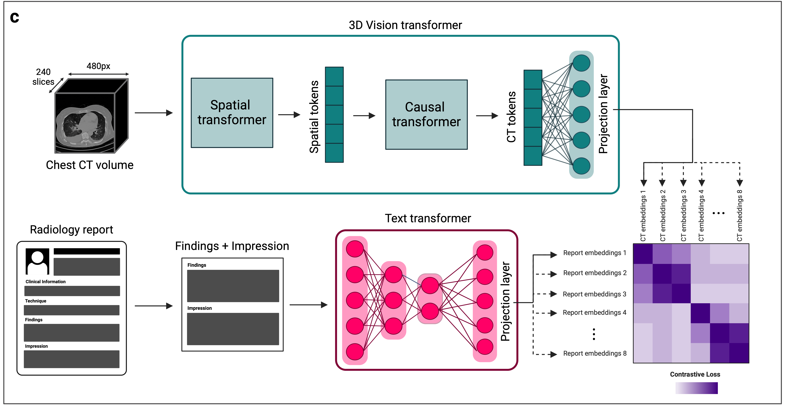
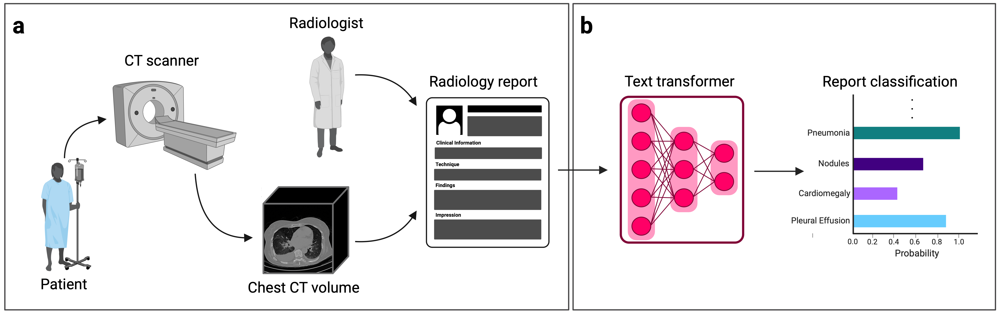

# CT-CLIP
Welcome to the official repository of CT-CLIP, a pioneering work in 3D medical imaging with a particular focus on chest CT volumes. CT-CLIP provides an open-source codebase and pre-trained models, all freely accessible to researchers. CT-CLIP is also utilized to develop a cutting-edge visual-language chat model, [CT-CHAT](https://github.com/ibrahimethemhamamci/CT-CHAT), designed specifically for 3D chest CT volumes. You can access the training dataset (CT-RATE) consisting of chest CT volumes paired with radiology text reports via the [HuggingFace repository](https://huggingface.co/datasets/ibrahimhamamci/CT-RATE).


<p align="center">
  
</p>


## Requirements

Before you start, set up the environment in this order:

```setup
# 1) Create conda env (Python 3.10)
conda create -n test python=3.10 -y
conda activate test

# 2) Install PyTorch (official torch118 command)
pip install torch torchvision torchaudio --index-url https://download.pytorch.org/whl/cu118

# 3) Install original CT-CLIP packages
# Navigate to the 'transformer_maskgit' directory and install the required packages
cd transformer_maskgit
pip install -e .

# Return to the root directory
cd ..

# Navigate to the 'CT_CLIP' directory and install its required packages
cd CT_CLIP
pip install -e .

# Return to the root directory
cd ..
```
After following these steps, your environment should be properly set up with all required packages.

Alternative setup options (backup):

```bash
# Option A: use conda yaml directly
conda env create -f environment.yml
conda activate test

# Option B: use requirements.txt in an existing env
pip install -r requirements.txt
```

The CT-CLIP model necessitates the use of an A100 GPU with 80GB of VRAM for a batch size of 8 for efficient training, due to the model's considerable size. Inference can be done in smaller GPUs. The patch sizes of the image encoder can be adjusted to make it fit onto smaller GPUs, although this will affect the model performance in smaller pathologies. Batch size can also be lowered, but this is not recommended for CLIP training as it will not learn negative images with lower batch sizes.

## Training

For details on the training of zero-shot CT-CLIP and fine-tuned CT-CLIP models, please navigate to [scripts](scripts).

For details on the training of text classifier, please navigate to [text_classifier](text_classifier).

## Inference

For details on the inference and evaluation of zero-shot CT-CLIP and fine-tuned CT-CLIP models, please navigate to [scripts](scripts).

For details on the inference of text classifier, please navigate to [text_classifier](text_classifier).

Inference with CT-CLIP (zero-shot) and CT-CLIP (VocabFine) takes approximately 1.5 seconds to assess 18 pathologies from a single CT volume, while inference with CT-CLIP (ClassFine) takes just 0.5 seconds for the same task.

## HCC Group Classification Extension (Local)

This repo also includes a local extension for HCC necrosis group classification:

- Train entry: `scripts/ct_lipro_train.py --task regression`
- Test entry: `scripts/run_zero_shot.py --task regression --stage test`
- Prompt template ablations: `arterial_only`, `arterial_portal`, `all_features`, `tumor_markers_text_only`
- Patient-level handling for two sequences: `--scan-handling distinguish|ignore`
- Config-specific outputs under `inference_hcc_regression/<subdir>/`
- Test enforces strict consistency against training via `split_manifest.json` + `checkpoint_manifest.json`
- Training logs are saved per-run: `train_config.json`, `train_lr_log.csv`, `train_epoch_log.csv`

`scripts/run_train.py` is the original CT-CLIP pretraining entry (contrastive training on chest CT/report pairs), while `scripts/ct_lipro_train.py --task regression` is the HCC downstream fine-tuning entry.

Default HCC mode:
- Primary task: `坏死比例分组` (0/1)
- Default mode: `--necrosis-mode group_only` (BCE only)
- Optional legacy mode: `--necrosis-mode multitask` (group + ratio)
- Recommended default train mode: `--train-mode vocabfine`

### 4 Templates: Training + Testing (Default `vocabfine`)

Set repo root first:

```bash
export REPO_ROOT=/path/to/CT-CLIP
cd ${REPO_ROOT}
```

Template 1: `arterial_only`

```bash
python scripts/ct_lipro_train.py --task regression \
  --necrosis-mode group_only --train-mode vocabfine \
  --train-n 4 --epochs 20 --lr 1e-4 \
  --scan-handling distinguish --prompt-template arterial_only \
  --run-name tmpl1-arterial_only-vocabfine-train

python scripts/run_zero_shot.py --task regression --stage test \
  --necrosis-mode group_only --train-mode vocabfine --train-n 4 \
  --scan-handling distinguish --prompt-template arterial_only \
  --load-model ${REPO_ROOT}/inference_hcc_regression/tmpl1-arterial_only-vocabfine-train/regressor.pt \
  --split-file ${REPO_ROOT}/inference_hcc_regression/tmpl1-arterial_only-vocabfine-train/split_manifest.json \
  --run-name tmpl1-arterial_only-vocabfine-test
```

Template 2: `arterial_portal`

```bash
python scripts/ct_lipro_train.py --task regression \
  --necrosis-mode group_only --train-mode vocabfine \
  --train-n 4 --epochs 20 --lr 1e-4 \
  --scan-handling distinguish --prompt-template arterial_portal \
  --run-name tmpl2-arterial_portal-vocabfine-train

python scripts/run_zero_shot.py --task regression --stage test \
  --necrosis-mode group_only --train-mode vocabfine --train-n 4 \
  --scan-handling distinguish --prompt-template arterial_portal \
  --load-model ${REPO_ROOT}/inference_hcc_regression/tmpl2-arterial_portal-vocabfine-train/regressor.pt \
  --split-file ${REPO_ROOT}/inference_hcc_regression/tmpl2-arterial_portal-vocabfine-train/split_manifest.json \
  --run-name tmpl2-arterial_portal-vocabfine-test
```

Template 3: `all_features`

```bash
python scripts/ct_lipro_train.py --task regression \
  --necrosis-mode group_only --train-mode vocabfine \
  --train-n 4 --epochs 20 --lr 1e-4 \
  --scan-handling distinguish --prompt-template all_features \
  --run-name tmpl3-all_features-vocabfine-train

python scripts/run_zero_shot.py --task regression --stage test \
  --necrosis-mode group_only --train-mode vocabfine --train-n 4 \
  --scan-handling distinguish --prompt-template all_features \
  --load-model ${REPO_ROOT}/inference_hcc_regression/tmpl3-all_features-vocabfine-train/regressor.pt \
  --split-file ${REPO_ROOT}/inference_hcc_regression/tmpl3-all_features-vocabfine-train/split_manifest.json \
  --run-name tmpl3-all_features-vocabfine-test
```

Template 4: `tumor_markers_text_only`

```bash
python scripts/ct_lipro_train.py --task regression \
  --necrosis-mode group_only --train-mode vocabfine \
  --train-n 4 --epochs 20 --lr 1e-4 \
  --prompt-template tumor_markers_text_only \
  --run-name tmpl4-tumor_markers_text_only-vocabfine-train

python scripts/run_zero_shot.py --task regression --stage test \
  --necrosis-mode group_only --train-mode vocabfine --train-n 4 \
  --prompt-template tumor_markers_text_only \
  --load-model ${REPO_ROOT}/inference_hcc_regression/tmpl4-tumor_markers_text_only-vocabfine-train/regressor.pt \
  --split-file ${REPO_ROOT}/inference_hcc_regression/tmpl4-tumor_markers_text_only-vocabfine-train/split_manifest.json \
  --run-name tmpl4-tumor_markers_text_only-vocabfine-test
```

Template semantics:
- `arterial_only`: arterial-phase CT only + minimal non-leakage background fields (`年龄/性别`)
- `arterial_portal`: arterial+portal venous CT + minimal non-leakage background fields (`年龄/性别`)
- `all_features`: arterial+portal venous CT + all non-target clinical Excel fields
- `tumor_markers_text_only`: no CT image, tumor-marker text only

HCC scan-phase convention in this repo:
- `1.nii.gz` = arterial phase
- `2.nii.gz` = portal venous phase

Prompt rendering now uses full field-level medical narrative sentences (for example, age/sex are injected as explicit clinical sentences), not a generic `{feature_text}` tail concatenation.

`tumor_markers_text_only` is a text-only ablation baseline: it does not load `1.nii.gz`/`2.nii.gz`, and only uses tumor-marker fields from Excel (`手术切除前AFP`, `手术切除前 PIVKA`, `诊断时AFP`, `诊断时PIVKA-II`).

### Visualization for All Subdirectories

`visualize_predictions.py` automatically scans all subdirectories under `inference_hcc_regression`, reads each `predictions.csv`, and writes `prediction_plot.png` back into each corresponding subdirectory.

The y-axis uses a global scale across all detected runs:
- Upper bound is fixed to `1.1`
- Lower bound is auto-scaled from global `target/pred` minimum values

Current plot conventions:
- Gray dashed line at `y=1.0`
- `#3399FF` = target, `#FFCC99` = prediction
- Positive class (`1`) uses circle marker; negative class (`0`) uses triangle marker (or `<1` for ratio mode)
- Target blue circles are intentionally larger to keep overlap visible

```bash
python visualize_predictions.py --overwrite
```

For more detailed usage, see [HCC_TRAIN_TEST_WORKFLOW.md](HCC_TRAIN_TEST_WORKFLOW.md), [DATASET_GUIDE.md](DATASET_GUIDE.md), and [HCC_REGRESSION_GUIDE.md](HCC_REGRESSION_GUIDE.md).


## Pretrained Models

For your convenience, we provide access to pretrained models directly. These models have been trained on our paired radiological report and chest CT volume dataset, as elaborated in the paper.

You can download the models from the following links:

- **CT-CLIP**: [Download Here](https://huggingface.co/datasets/ibrahimhamamci/CT-RATE/blob/main/models/CT-CLIP-Related/CT-CLIP_v2.pt)

- **CT-CLIP (VocabFine)**: [Download Here](https://huggingface.co/datasets/ibrahimhamamci/CT-RATE/blob/main/models/CT-CLIP-Related/CT_VocabFine_v2.pt)

- **CT-CLIP (ClassFine)**: [Download Here](https://huggingface.co/datasets/ibrahimhamamci/CT-RATE/blob/main/models/CT-CLIP-Related/CT_LiPro_v2.pt)
  
- **Text Classifier Model**: [Download Here](https://huggingface.co/datasets/ibrahimhamamci/CT-RATE/blob/main/models/RadBertClassifier.pth)

By leveraging these pretrained models, you can easily reproduce our results or further extend our work.


## Our Dataset (CT-RATE)

A major challenge in computational research in 3D medical imaging is the lack of comprehensive datasets. Addressing this issue, we present CT-RATE, the first 3D medical imaging dataset that pairs images with textual reports. CT-RATE consists of 25,692 non-contrast chest CT volumes, expanded to 50,188 through various reconstructions, from 21,304 unique patients, along with corresponding radiology text reports, multi-abnormality labels, and metadata. We divided the cohort into two groups: 20,000 patients were allocated to the training set and 1,304 to the validation set. Our folders are structured as split_patientID_scanID_reconstructionID. For instance, "valid_53_a_1" indicates that this is a CT volume from the validation set, scan "a" from patient 53, and reconstruction 1 of scan "a". This naming convention applies to all files.

<p align="center">
  
</p>

You can download the dataset used in this work via the [Hugging Face repository](https://huggingface.co/datasets/ibrahimhamamci/CT-RATE). 

Data used to finetune and validate the text classifier model can be accessed [here](text_classifier/data).


## Citing Us
If you use CT-RATE or CT-CLIP, we would appreciate your references to [our paper](https://arxiv.org/abs/2403.17834).


## License
We are committed to fostering innovation and collaboration in the research community. To this end, all elements of CT-CLIP are released under a [Creative Commons Attribution (CC-BY-NC-SA) license](https://creativecommons.org/licenses/by-nc-sa/4.0/). This licensing framework ensures that our contributions can be freely used for non-commercial research purposes, while also encouraging contributions and modifications, provided that the original work is properly cited and any derivative works are shared under similar terms.
